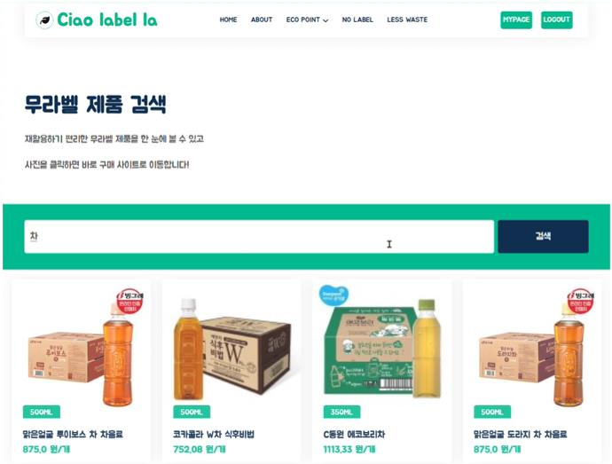
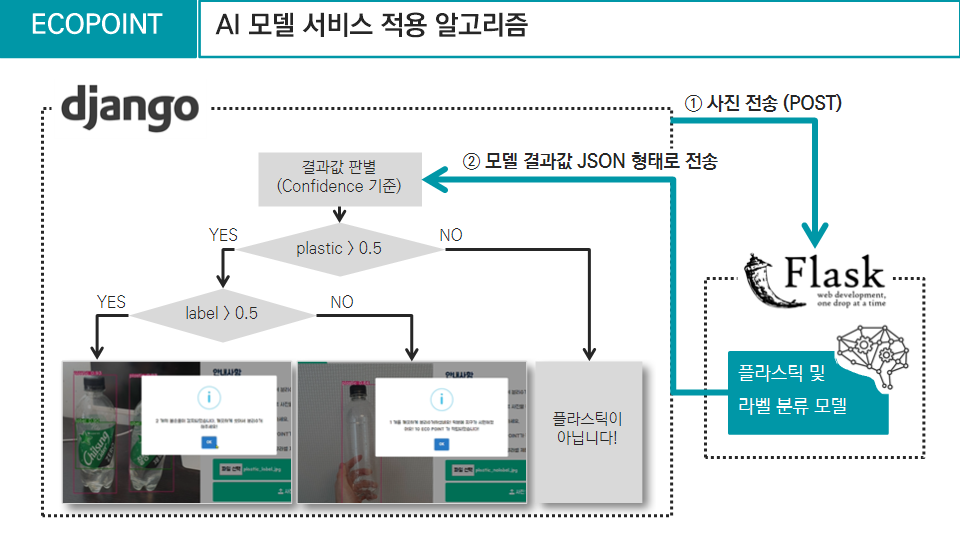
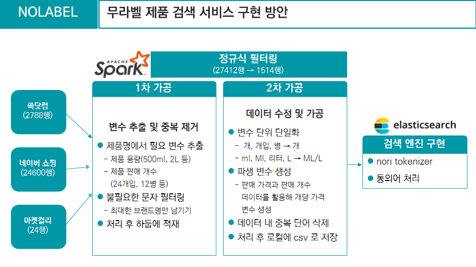
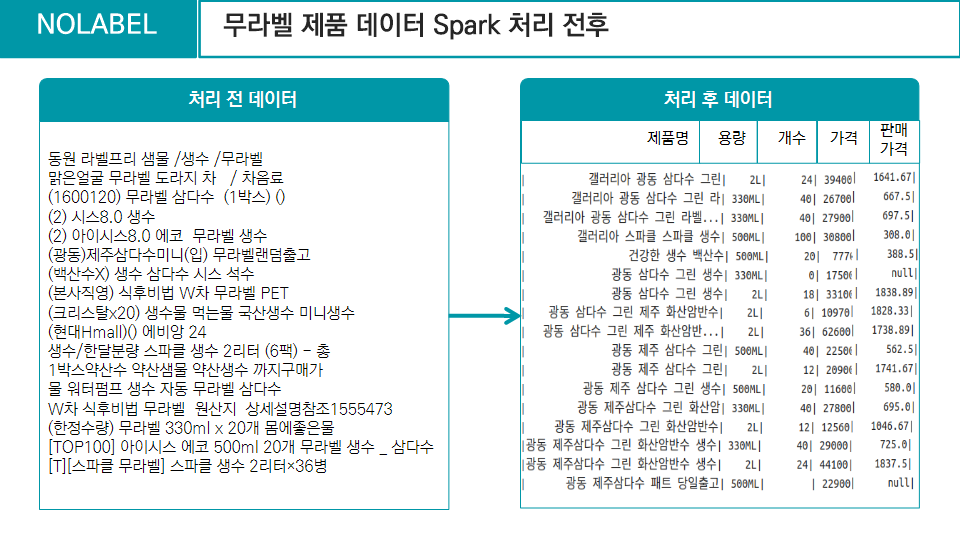

# 플라스틱 라벨 여부 이미지 인식에 따른 에코 포인트 적립 서비스 (Ciao label la)

---

- [1. 프로젝트 개요](#1-프로젝트-개요)
- [2. 서비스 소개](#2-서비스-소개)
  * [2.1. Ciao label la - 차오라벨라](#21-ciao-label-la---차오라벨라)
  * [2.2. 서비스 기대효과](#22-서비스-기대효과)
- [3. 서비스 설계](#3-서비스-설계)
  * [3.1. 서비스 아키텍처](#31-서비스-아키텍처)
  * [3.2. 서비스 ERD](#32-서비스-erd)
  * [3.3. 서비스 활용 데이터](#33-서비스-활용-데이터)
- [4. 서비스 구현](#4-서비스-구현)
  * [4.1. 에코포인트 적립 (Flask)](#41-에코포인트-적립)
  * [4.2. 무라벨 제품 검색 (Spark, Elasticsearch)](#42-무라벨-제품-검색)
  * [4.3. 내 주변 레스웨이스트 위치 조회 (MongoDB)](#43-내-주변-레스웨이스트-위치-조회)
  * [4.4. Trouble Shootings](#44-trouble-shootings)
---

## 1. 프로젝트 개요

- 프로젝트 기간 : 2022.08.18 ~ 2022.09.30
- 프로젝트 팀
  - Team Ohjijo
    - 데이터 엔지니어 : **주한나**, 고유정, 신부용
    - 데이터 사이언티스트 : **안소연**, 신기은, 인창환
- 프로젝트 배경
  - 2022년 기준 재생 플라스틱 시장의 연평균 성장률은 6.4% 이며 약 503억 달러(한화로 71조 원)
  - 2021년 기준 한국의 1인당 플라스틱 사용량은 세계 3위인 반면에 재활용률은 낮고 그동안 오히려 폐플라스틱을 수입해왔음 (2022년 6월부터 금지)
  - 플라스틱은 재활용 가능할수록 친환경적이고 재가공 원료 납품으로 수익이 증대하지만 재활용 불가능하다면 소각매립 비용이 발생하여 지출이 확대되고 환경이 파괴됨
  - 한국의 재활용 업체는 80%가 민간업체로 운영되고 있는데 한정된 수작업으로 수익보다는 지출이 확대되고 있는 상태
  - [재활용 가치](https://news.skecoplant.com/plant-tomorrow/10567/)가 높은 PET병은 국내 일회용 플라스틱 폐기물 발생량 중에 56억 개로 약 9.7% 비중 차지 ([기사](https://www.greenpeace.org/korea/press/25876/%EB%B3%B4%EB%8F%84%EC%9E%90%EB%A3%8C-%EC%BD%94%EB%A1%9C%EB%82%98-%EA%B8%B0%EA%B0%84-%EC%9D%BC%ED%9A%8C%EC%9A%A9-%ED%94%8C%EB%9D%BC%EC%8A%A4%ED%8B%B1-%ED%8F%90%EA%B8%B0%EB%AC%BC-presslease-plastic-repo/))
  - 한국소비자원의 통계에 따르면 투명 페트병을 분리수거할 때 10명 중 7명이 라벨 제거를 힘들어하고 페트병에 부착된 라벨을 올바르게 제거 및 분리 배출하는 비중은 40.9%에 불과 (한국소비자원)
  - MZ 세대 입장에서 가장 파급효과가 큰 친환경 제품은 전기/수소차가 아닌 무라벨 페트병이 41.1% (미디어리얼리서치코리아)
  - 자원 재활용률을 높이기 위해 가장 효율적인 첫 걸음은 플라스틱의 라벨을 제거하여 제대로 분리수거하기
- 프로젝트 주제
  - 플라스틱 라벨 여부 이미지 인식에 따른 에코 포인트 적립 서비스
  - 친환경 제품 및 위치 조회 서비스
    - 라벨이 있는 식음료 제품 대신 대체 가능한 무라벨 제품 및  안내
    - 플라스틱을 재활용하면 돈을 주는 리사이클박스 네프론과 친환경 제품 판매하는 레스웨이스트샵 위치 안내
- 프로젝트 결과
  - 기업요구사항 기반의 문제해결 프로젝트 우수상  수상 (멀티캠퍼스)

 

## 2. 서비스 소개

### 2.1. Ciao label la - 차오라벨라

> Ciao label la 는 플라스틱 재활용률을 높이기 위한 친환경 서비스 플랫폼이며 주요 기능은 다음과 같습니다.

- **서비스 메인 화면 (HOME)**

- **서비스 소개 화면 (ABOUT)**

- **에코포인트 적립 서비스 1** 
  - 플라스틱 라벨 제거 후 인증 성공 시 (AI 모델)

- **에코포인트 적립 서비스 2**
  - 무라벨 제품 구매 영수증 인증 성공 시 (OCR API)

- **무라벨 제품 검색**

- **내 주변 레스웨이스트 위치 조회**

- **마이페이지**
  - 적립한 에코 포인트에 따른 **에코 레벨** 부여
  - 에코 포인트 적립 현황 조회

### 2.2. 서비스 기대효과

- 에코 포인트 적립 및 에코 레벨 부여를 통해 사용자의 친환경 행보를 지속적으로 유도
- 친환경 제품 및 서비스 조회를 통해 해당 제품과 서비스에 대한 접근성 제공
- 친환경에 관심이 많은 특정 유저 확보 기대

 

## 3. 서비스 설계

### 3.1. 서비스 아키텍처

  

 

### 3.2. 서비스 ERD

  

- MySQL
  - 회원 데이터 : Ciaolabella 에 회원가입한 회원 정보
  - 에코포인트 적립 데이터 : 회원들의 에코포인트 적립 내역
- Elasticsearch
  - 무라벨 제품 데이터 : 검색 엔진 구현 위해 Elasticsearch 선택
  - 실시간 사용자 로그 데이터 : Kibana 로 실시간 시각화 위해 Elasticsearch 선택
- MongoDB
  - 제로웨이스트샵 위치 데이터 : 반경 필터링을 사용하기 위해 MongoDB 선택
  - 리사이클박스 위치 데이터 : 반경 필터링을 사용하기 위해 MongoDB 선택

 

### 3.3. 서비스 활용 데이터

- 데이터 명세서

| 출처                                   | 수집 방식           | 형식     | 활용                        |
| -------------------------------------- | ------------------- | -------- | --------------------------- |
| 생활폐기물 이미지 및 라벨(AI HUB)      | 파일                | IMG/JSON | AI 모델 학습 이미지         |
| 생활폐기물 이미지 및 라벨(직접 수집)   | 직접 수집 및 라벨링 | IMG/JSON | AI 모델 학습 이미지         |
| 네이버 쇼핑                            | 크롤링              | CSV      | 무라벨 제품 검색            |
| 마켓컬리                               | 크롤링              | CSV      | 무라벨 제품 검색            |
| 쓱닷컴                                 | 크롤링              | CSV      | 무라벨 제품 검색            |
| 슈퍼빈 : 네프론 위치 정보              | API                 | JSON     | 리사이클 박스 위치 조회     |
| 스마트서울맵 제로웨이스트상점          | API                 | JSON     | 제로웨이스트 가게 위치 조회 |
| 우리동네 제로웨이스트샵                | 크롤링              | CSV      | 제로웨이스트 가게명 및 주소 |
| 지도_전국 제로웨이스트숍               | 크롤링              | CSV      | 제로웨이스트 가게명 및 주소 |
| 카카오 제로웨이스트숍/리필/재활용 가게 | 크롤링              | CSV      | 제로웨이스트 가게명 및 주소 |
| 카카오 API                             | API                 | JSON     | 제로웨이스트 가게 위치 조회 |

 

## 4. 서비스 구현

### 4.1. 에코포인트 적립

 

### 4.2. 무라벨 제품 검색

 

### 4.3. 내 주변 레스웨이스트 위치 조회

 

### 4.4. Trouble Shootings

